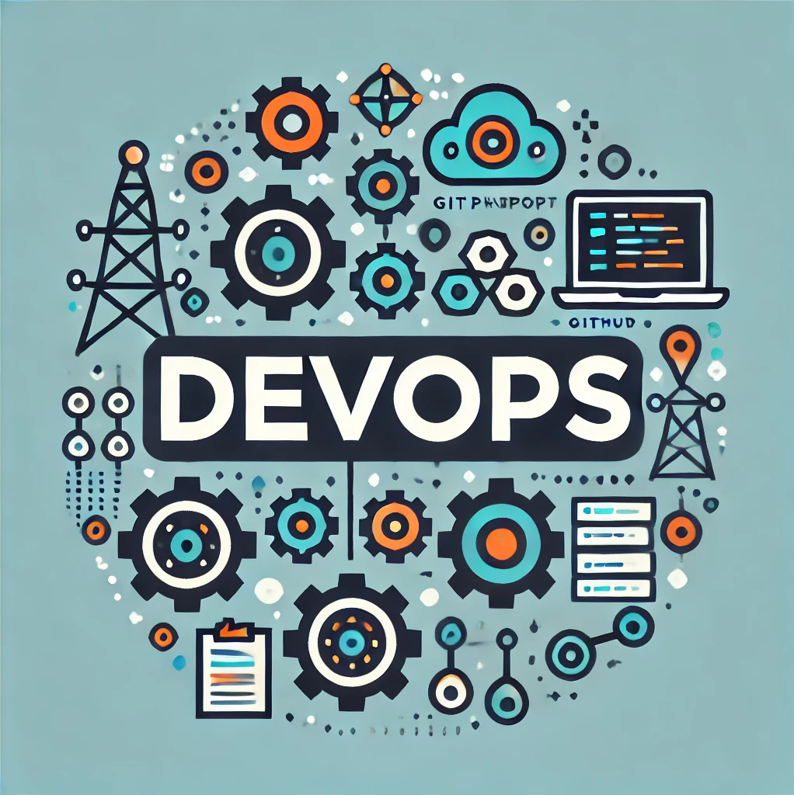
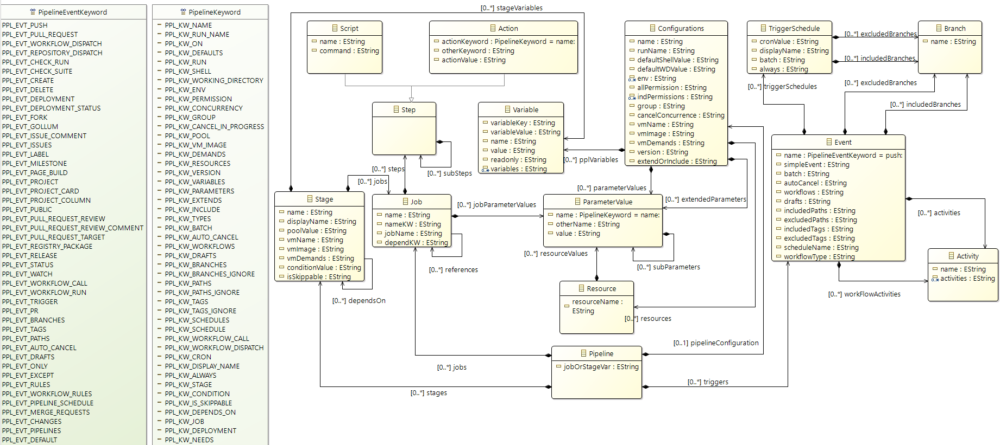

# DevOps Dialect Editor



**Welcome to DevOps Dialect Editor**, a comprehensive tool designed to facilitate cross-platform analysis of DevOps automation pipelines. This repository contains the source code for an Xtext-based multi-platform editor, which supports dialects from a variety of platforms including GitHub Actions, GitLab, Bitbucket, Azure DevOps, Bamboo, and Circle CI. The aim is to provide DevOps researchers and practitioners with a unified environment for analyzing multi-platform pipeline specifications.

## Features

- **Multi-Platform Language Editor**: A domain-specific language (DSL) is provided to enable consistent parsing and analysis of DevOps pipelines across multiple CI/CD platforms.
- **Xtext-Based Environment**: Built using Xtext, the editor supports syntax validation, keyword highlighting, and strict indentation policies for YAML-based pipeline definitions.
- **Pipeline Dataset for Research**: A dataset of over 42,000 automation pipelines scraped from open-source projects is available to help validate pipeline specifications.
- **Cross-Platform Pipeline Analysis**: The editor allows researchers to analyze common patterns in DevOps pipeline usage across different CI/CD platforms to understand frequent practices and discover new optimizations.

## Installation

1. Clone the repository:
   ```sh
   git clone https://github.com/yourusername/DevOps-Dialect-Editor.git
   cd DevOps-Dialect-Editor
   ```

2. Install dependencies:
   - Ensure you have Java (JDK 11 or later) installed.
   - Install Eclipse IDE with Xtext plugin.

3. Open the project in Eclipse IDE:
   - Import the project as an existing Maven or Gradle project.

## Usage

- **Opening the Editor**: Open any `.pipeline` file using the DevOps Dialect Editor in Eclipse IDE.
- **Validating Pipelines**: The editor automatically checks for platform-specific keywords, indentation issues, and malformed configurations.
- **Exploring the Dataset**: The dataset is pre-processed to help researchers and practitioners examine automation pipelines from multiple CI/CD platforms. The dataset includes pipelines from GitHub, GitLab, Azure DevOps, BitBucket, Bamboo, and Circle CI.

## Metamodel
Version 2.0 Metamodel


## Dataset Preparation

The heterogeneous dataset of DevOps pipelines was collected from both GitHub and Software Heritage, including over 42,000 YAML pipeline files. The dataset helps validate the generalizability of the language model used in this editor.

The dataset can be used to:
- Identify common pipeline specification patterns.
- Study platform-specific differences.

## Key Contributions

1. **Domain-Specific Language for Cross-Platform Pipelines**: Supports pipeline dialects from major CI/CD platforms, facilitating multi-platform compatibility and consistency in pipeline analysis.
2. **Editor Implementation**: An Xtext-based editor that allows syntax validation and keyword highlighting for easy identification of pipeline issues.
3. **Dataset Collection Process**: An elaborate dataset of YAML pipelines, offering a diverse collection of CI/CD specifications mined from open-source projects to facilitate empirical research and analysis.

## Example Pipeline Syntax

Here is an example of a GitHub Actions pipeline:

```yaml
name: Example Pipeline
on: push
jobs:
  build:
    runs-on: ubuntu-latest
    steps:
      - name: Checkout
        uses: actions/checkout@v2
      - name: Run Tests
        run: ./gradlew test
```

The DevOps Dialect Editor provides syntax highlighting and validation for similar pipeline configurations from multiple platforms, ensuring that developers can seamlessly work across different CI/CD environments.

## How to Contribute

We welcome contributions to improve DevOps Dialect Editor. To contribute:

1. Fork this repository.
2. Create a new branch:
   ```sh
   git checkout -b feature-branch
   ```
3. Commit your changes and push:
   ```sh
   git commit -m "Added new feature"
   git push origin feature-branch
   ```
4. Open a pull request to the `main` branch of this repository.

Please make sure to follow the code of conduct outlined in `CONTRIBUTING.md`.

<!-- ## License

This project is licensed under the MIT License. See the `LICENSE` file for more details. -->

## Acknowledgements

This project was developed as part of a research initiative presented at the SAM/MODELS 2024 conference. We acknowledge the support of the Natural Sciences and Engineering Research Council of Canada (NSERC).

For more information, see the original paper: [A Multi-Platform Specification Language and Dataset for the Analysis of DevOps Pipelines](https://doi.org/10.1145/3652620.3686247).

## Contact

For questions or collaboration requests, feel free to reach out:
- Manas Bedekar: [manas.bedekar@mail.mcgill.ca](mailto:manas.bedekar@mail.mcgill.ca)

## Citation

If you use DevOps Dialect Editor in your research, please cite our paper:
```
@inproceedings{bedekar2024multipatform,
  title={A Multi-Platform Specification Language and Dataset for the Analysis of DevOps Pipelines},
  author={Manas Manoj Bedekar and Gunter Mussbacher},
  booktitle={ACM/IEEE 27th International Conference on Model Driven Engineering Languages and Systems (MODELS Companion '24)},
  year={2024},
  location={Linz, Austria},
  publisher={ACM},
  doi={10.1145/3652620.3686247}
}
```

